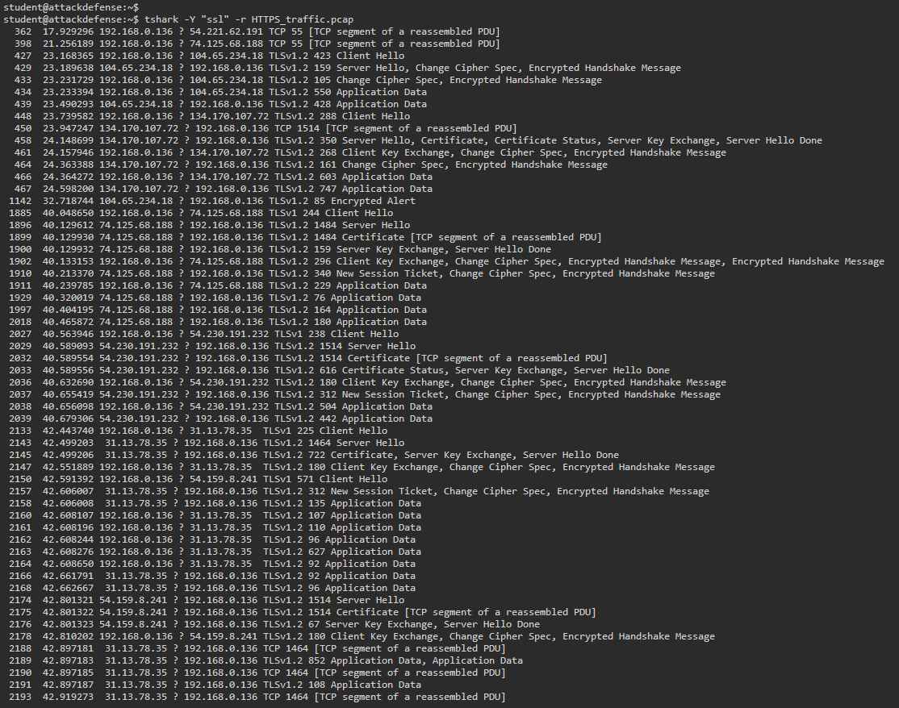
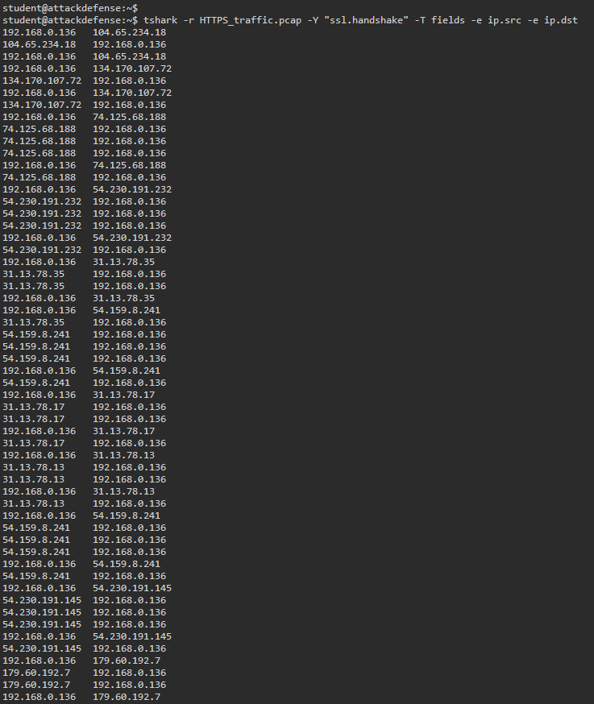
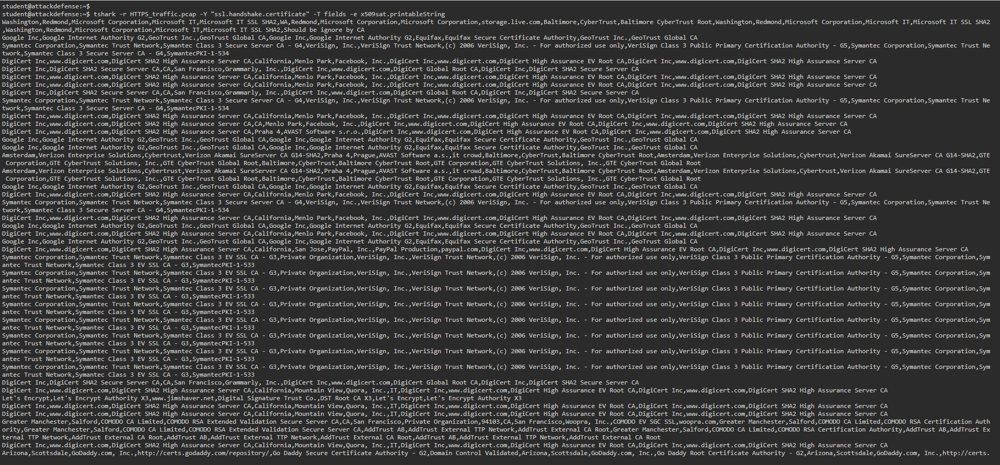
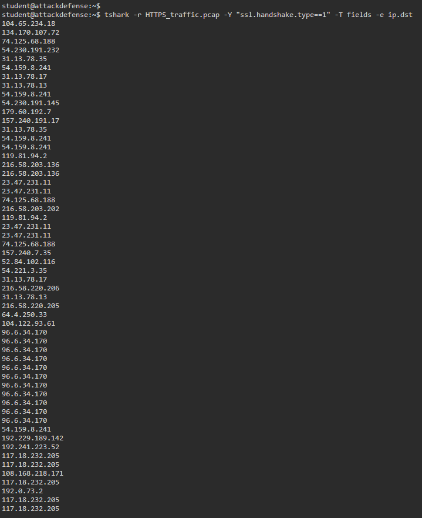
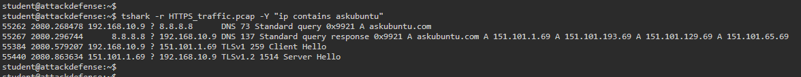
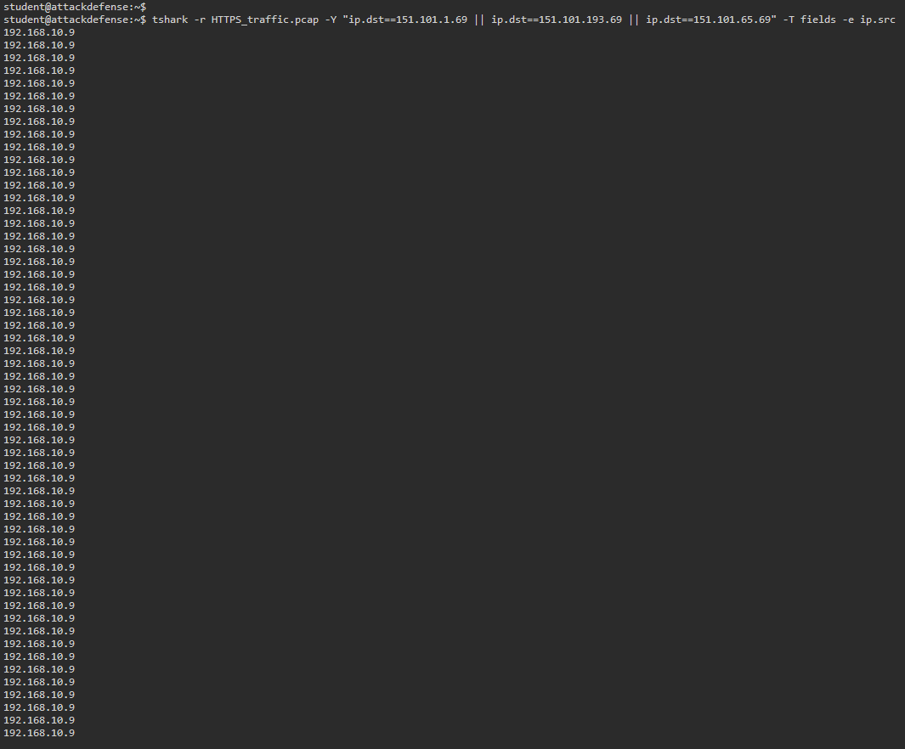
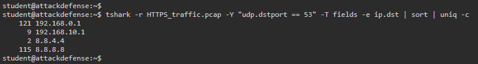
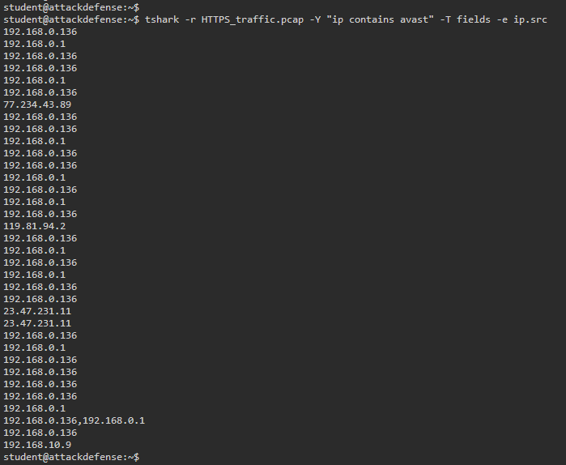

# SOC Investigation Report
## Case ID: NTA-2026-HTTPS-001
## Network Traffic Analysis - Encrypted HTTPS Traffic Investigation

---

> **Classification:** TLP:WHITE - Portfolio / Training Exercise
> **Analyst:** Miro Lerch
> **Platform:** AttackDefense Labs (PentesterAcademy)
> **Lab:** Filtering Advanced: HTTPS
> **Date:** 2026
> **Status:** CLOSED - Analysis Complete

---

## Executive Summary

Während einer geplanten Netzwerkverkehrs-Analyse wurde eine PCAP-Aufzeichnung (`HTTPS_traffic.pcap`) mit verschlüsselten HTTPS/TLS-Sitzungen mithilfe von `tshark` untersucht, um verwertbare Informationen aus den Metadaten des verschlüsselten Datenverkehrs zu extrahieren. Obwohl HTTPS den Payload verschlüsselt, sind durch TLS-Handshake-Metadaten, DNS-Abfragemuster, Zertifikatsaussteller-Felder und Verhaltens-Fingerprinting weiterhin bedeutende forensische Erkenntnisse zugänglich.

Diese Untersuchung zeigt, dass verschlüsselter Datenverkehr für einen erfahrenen SOC-Analysten nicht undurchsichtig ist. Durch gezieltes Filtern und Feldextraktion wurden folgende Erkenntnisse gewonnen:

- Mehrere SSL/TLS-Sitzungen zu externen Servern wurden identifiziert und kartiert
- DNS-Auflösungsmuster enthüllten das Verhalten interner Clients und die Server-Infrastruktur
- Zertifikatsaussteller-Ketten legten die Identität der kontaktierten Dienste offen
- Avast-Antivirus-Datenverkehr wurde auf drei internen Hosts durch Verhaltens-Fingerprinting identifiziert
- Der interne Host `192.168.10.9` wurde als einziger Nutzer bestätigt, der mit Ask-Ubuntu-Servern kommuniziert hat

Es wurde keine schädliche Aktivität bestätigt, jedoch lässt sich die hier angewandte Methodik direkt auf Threat Hunting, C2-Beacon-Erkennung und die Analyse von verschlüsseltem Malware-Datenverkehr übertragen.

---

## Threat Scenario

| Field | Value |
|---|---|
| Scenario Type | Network Forensics - Encrypted Traffic Analysis |
| Traffic Type | HTTPS / TLS 1.2 |
| Capture File | HTTPS_traffic.pcap |
| Analysis Tool | tshark (Wireshark CLI) |
| Environment | Internal LAN segment + external internet |
| Analyst Objective | Extract intelligence from encrypted traffic without decryption |

---

## Investigation Walkthrough

### Phase 1 - SSL/TLS Traffic Isolation

**Objective:** Isolate all SSL/TLS traffic from the full capture.

```bash
tshark -Y 'ssl' -r HTTPS_traffic.pcap
```

**Finding:** Packets containing TLS 1.2 sessions were returned, including `Client Hello`, `Server Hello`, `Certificate`, `Change Cipher Spec`, `Application Data`, and `Encrypted Alert` messages. This confirms active TLS sessions between internal hosts and external servers.

**Analyst Note:** Even without decrypting the payload, the TLS record types alone reveal session lifecycle — useful for detecting incomplete handshakes (potential scanning), unexpected `Encrypted Alert` messages (connection tears that may indicate detection evasion), and unusual handshake timing.



---

### Phase 2 - TLS Handshake Source/Destination Mapping

**Objective:** Map all endpoints participating in TLS handshakes.

```bash
tshark -r HTTPS_traffic.pcap -Y "ssl.handshake" -Tfields -e ip.src -e ip.dst
```

**Finding:** Multiple handshake pairs were identified between the internal host `192.168.0.136` and external IPs including:

| Source IP | Destination IP |
|---|---|
| 192.168.0.136 | 104.65.234.18 |
| 192.168.0.136 | 134.170.107.72 |
| 192.168.0.136 | 74.125.68.188 |
| 192.168.0.136 | 54.230.191.232 |

**Analyst Note:** Bidirectional handshake pairs are expected. A host initiating many TLS handshakes in a short window without corresponding DNS queries can indicate C2 beaconing to hardcoded IP addresses — a key threat hunting pivot.



---

### Phase 3 - Certificate Issuer Extraction

**Objective:** Identify the certificate authorities and organizations behind the SSL sessions.

```bash
tshark -r HTTPS_traffic.pcap -Y "ssl.handshake.certificate" -Tfields -e x509sat.printableString
```

**Finding:** The following certificate issuers were extracted:

| Certificate Issuer |
|---|
| Microsoft Corporation - Microsoft IT SSL SHA2 |
| Google Inc - Google Internet Authority G2 - GeoTrust |
| Symantec Class 3 Secure Server CA G4 - VeriSign Trust Network |
| DigiCert SHA2 High Assurance Server CA - Facebook, Inc. |
| DigiCert SHA2 Secure Server CA - Grammarly, Inc. |
| Let's Encrypt Authority X3 |
| GoDaddy Secure Certificate Authority G2 |
| AVAST Software s.r.o. - DigiCert SHA2 High Assurance Server CA |

**Analyst Note:** Certificate issuer extraction without decryption is a legitimate intelligence technique. In threat hunting, self-signed certificates, certificates issued by unknown CAs, or certificates with anomalous validity periods are high-fidelity indicators of malicious infrastructure. All issuers here are legitimate.



---

### Phase 4 - Server IP Enumeration via Client Hello

**Objective:** List all external servers the internal network established SSL connections to.

```bash
tshark -r HTTPS_traffic.pcap -Y "ssl.handshake.type==1" -Tfields -e ip.dst
```

**Finding - SSL Server IPs:**

| Destination IP | Likely Owner |
|---|---|
| 104.65.234.18 | Akamai CDN |
| 134.170.107.72 | Microsoft |
| 74.125.68.188 | Google |
| 54.230.191.232 | Amazon CloudFront |
| 31.13.78.35 | Facebook |
| 54.159.8.241 | Amazon AWS |
| 31.13.78.17 | Facebook |
| 157.240.191.17 | Facebook |
| 179.60.192.7 | Facebook |
| 119.81.94.2 | IBM / SoftLayer |

**Analyst Note:** Repeated Client Hellos to the same IP without session reuse can indicate connection instability or automated tooling. In real incidents, C2 servers often appear as repeated TLS connections to a single external IP.



---

### Phase 5 - Ask Ubuntu Server Identification

**Objective:** Identify the IP addresses of Ask Ubuntu servers.

```bash
tshark -r HTTPS_traffic.pcap -Y "ip contains askubuntu"
```

**Finding - Ask Ubuntu Server IPs:**

| IP Address | Role |
|---|---|
| 151.101.1.69 | Ask Ubuntu / Fastly CDN |
| 151.101.193.69 | Ask Ubuntu / Fastly CDN |
| 151.101.129.69 | Ask Ubuntu / Fastly CDN |
| 151.101.65.69 | Ask Ubuntu / Fastly CDN |

**Analyst Note:** The `ip contains` filter matches string patterns within packet payloads — the same technique used to detect malware C2 strings, credential harvesting domains, and data exfiltration markers in network traffic.



---

### Phase 6 - Ask Ubuntu Client Identification

**Objective:** Identify the internal user who contacted Ask Ubuntu servers.

```bash
tshark -r HTTPS_traffic.pcap -Y "ip.dst==151.101.1.69 || ip.dst==151.101.193.69 || ip.dst==151.101.129.69 || ip.dst==151.101.65.69" -Tfields -e ip.src
```

**Finding:** `192.168.10.9` - sole internal host querying Ask Ubuntu servers.

**Analyst Note:** Chaining filters from Phase 5 to Phase 6 demonstrates a core SOC workflow - identify the server first, then pivot to find the internal client. This same method is used to identify which internal host communicated with a known malicious IP.



---

### Phase 7 - DNS Resolver Identification

**Objective:** Identify DNS servers used by internal clients.

```bash
tshark -r HTTPS_traffic.pcap -Y "udp.dstport == 53" -Tfields -e ip.dst | sort | uniq -c
```

**Finding - DNS Servers Used:**

| DNS Server IP | Type |
|---|---|
| 192.168.0.1 | Internal gateway |
| 192.168.10.1 | Internal subnet gateway |
| 8.8.8.8 | Google Public DNS |
| 8.8.4.4 | Google Public DNS (secondary) |

**Analyst Note:** Clients using Google's public DNS (8.8.8.8 / 8.8.4.4) directly - bypassing an internal DNS resolver - is a common threat hunting indicator. This behavior is used by malware to bypass DNS-based filtering and sinkholing. In an enterprise environment, direct external DNS queries should trigger a detection alert.



---

### Phase 8 - Passive Antivirus Fingerprinting

**Objective:** Identify hosts running Avast Antivirus through traffic content matching.

```bash
tshark -r HTTPS_traffic.pcap -Y "ip contains avast" -Tfields -e ip.src
```

**Finding - Hosts Running Avast:**

| Internal IP |
|---|
| 192.168.10.9 |
| 192.168.0.1 |
| 192.168.0.136 |

**Analyst Note:** Some AV products embed their product name in HTTP User-Agent headers or beacon URLs. This same methodology is used by threat hunters to fingerprint software inventory passively, and by red teams to identify what AV is running on target hosts.



---

## IOC Table

| Type | Value | Context | Confidence |
|---|---|---|---|
| IPv4 Internal | 192.168.0.136 | Primary TLS-communicating host | High |
| IPv4 Internal | 192.168.10.9 | Queried askubuntu.com; running Avast | High |
| IPv4 Internal | 192.168.0.1 | Internal gateway; Avast detected | Medium |
| IPv4 External | 104.65.234.18 | TLS session target (Akamai) | Informational |
| IPv4 External | 134.170.107.72 | TLS session target (Microsoft) | Informational |
| IPv4 External | 74.125.68.188 | TLS session target (Google) | Informational |
| IPv4 External | 54.230.191.232 | TLS session target (Amazon) | Informational |
| IPv4 External | 151.101.1.69 | Ask Ubuntu / Fastly CDN | Informational |
| IPv4 DNS | 8.8.8.8 | Direct external DNS - policy violation | Low |
| IPv4 DNS | 8.8.4.4 | Direct external DNS - policy violation | Low |
| Certificate Issuer | AVAST Software s.r.o. | TLS cert issuer identified in traffic | Informational |
| Software | Avast Antivirus | Identified via traffic fingerprint | High |

---

## MITRE ATT&CK Mapping

| Technique ID | Technique Name | Relevance |
|---|---|---|
| T1071.001 | Application Layer Protocol: Web Protocols | Primary communication protocol observed |
| T1071.004 | Application Layer Protocol: DNS | DNS queries used for baseline and C2 resolution in real attacks |
| T1572 | Protocol Tunneling | HTTPS used to encapsulate all communications |
| T1040 | Network Sniffing | Passive traffic capture — analyst technique |
| T1016 | System Network Configuration Discovery | DNS server identification reveals network architecture |
| T1518.001 | Software Discovery: Security Software Discovery | Avast fingerprinting via traffic analysis |
| T1567 | Exfiltration Over Web Service | HTTPS as potential exfiltration channel |

---

## Detection Opportunities

### Detection Rule 1 - Direct External DNS

```
event_type: dns_query
AND src_ip: 192.168.0.0/8
AND dst_ip: NOT [approved_internal_dns_servers]
AND dst_port: 53
```

**Severity:** Medium - Malware bypassing DNS sinkholes; DNS tunneling to external C2

---

### Detection Rule 2 - Unknown TLS Certificate Issuer

```
event_type: tls_handshake
AND tls.cert_issuer: NOT [approved_ca_list]
OR tls.cert_self_signed: true
```

**Severity:** High - Malware C2 using self-signed certificates; MitM attacks

---

### Detection Rule 3 - TLS Client Hello Without DNS Precedent

```
event_type: tls_client_hello
AND dst_ip: NOT IN [recently_resolved_ips]
AND timewindow: 60s
```

**Severity:** Medium - Hardcoded C2 IP addresses

---

### Detection Rule 4 - Passive Software Fingerprint

```
event_type: network_content_match
AND content_match: ["avast", "eset", "sophos", "crowdstrike"]
AND src_ip: NOT IN [known_av_update_servers]
```

**Severity:** Informational - Passive software inventory

---

## Incident Response Actions

**Priority 1:** Investigate direct external DNS usage on 8.8.8.8 / 8.8.4.4 - validate whether this is a policy exception or misconfiguration.

**Priority 2:** Correlate the TLS session inventory with the approved application whitelist.

**Priority 3:** Validate Avast version and license status on all three identified hosts.

**Priority 4:** Build a behavioral baseline for `192.168.10.9` - this host made direct external DNS queries, accessed Ask Ubuntu, and ran Avast.

---

## Containment / Eradication / Recovery

| Phase | Action | Priority |
|---|---|---|
| Containment | Block direct external DNS (port 53) at firewall for all internal hosts | High |
| Containment | Enforce DNS through corporate resolver only | High |
| Hardening | Implement TLS inspection proxy for corporate traffic | High |
| Hardening | Alert on unexpected certificate issuer changes for critical domains | Medium |

---

## Risk Assessment

| Risk Area | Risk Level | Recommendation |
|---|---|---|
| Direct external DNS | Medium | Block outbound port 53 except from approved resolver |
| TLS visibility | Medium | Evaluate TLS inspection proxy |
| Software inventory | Low | Validate all hosts in MDM/EDR platform |
| Encrypted exfiltration | Medium | Implement DLP at proxy layer |

---

## Lessons Learned

1. **Verschlüsselter Traffic ist nicht blind.** TLS-Handshake-Metadaten liefern erhebliche Informationen ohne Entschlüsselung.

2. **DNS ist eine forensische Goldgrube.** DNS-Abfragemuster enthüllen Verhalten, Software-Inventar und potenzielle Policy-Verstöße.

3. **String-Matching im Traffic funktioniert für passives Fingerprinting.** Der `ip contains` Filter matched Strings in Netzwerkpaketen — dieselbe Technik erkennt Malware-C2-Strings.

4. **tshark Feldextraktion ermöglicht skalierbare Analyse.** `-Tfields -e field.name` transformiert Paketanalyse in strukturierte Daten für SIEM-Korrelation.

5. **Direktes externes DNS ist eine Detection-Möglichkeit.** Malware nutzt routinemäßig 8.8.8.8 um internes DNS-Monitoring zu umgehen.

---

## Skills Demonstrated

| Skill | Evidence |
|---|---|
| PCAP-Analyse mit tshark | Alle 8 Investigation Commands |
| TLS/SSL Protokollkenntnisse | Handshake-Filterung, Zertifikatsextraktion |
| DNS Forensics | DNS-Flag-Filterung, Resolver-Identifikation |
| Behavioral Fingerprinting | Avast-Identifikation via Content Matching |
| Network IOC Extraction | IP, Zertifikat und Software IOC-Tabelle |
| Threat Hunting Mindset | Detection Rules aus Investigation-Findings |
| SOC Dokumentation | Strukturiertes Case File mit MITRE Mapping |
| MITRE ATT&CK Framework | 7 relevante Techniken gemappt |

---

## Tools Used

| Tool | Purpose |
|---|---|
| tshark | CLI-basierte PCAP-Analyse, Feldextraktion, Display Filter |
| Wireshark | Visuelle Validierung und Filter-Syntax-Referenz |
| MITRE ATT&CK | Technique Mapping |
| AttackDefense Labs | Lab-Umgebung und PCAP-Quelle |

---

## About This Project

Dieses Projekt demonstriert die Fähigkeit, Netzwerk-Forensik auf verschlüsseltem HTTPS-Traffic durchzuführen - eine Kernkompetenz für SOC-Analysten und DFIR-Investigatoren. Anstatt verschlüsselten Traffic als Sackgasse zu behandeln, wurde Protokoll-Wissen angewendet um bedeutende Informationen zu extrahieren: Endpoint-Mapping, Zertifikatsketten-Analyse, DNS-Verhaltens-Profiling und passives Software-Inventar via Verhaltens-Fingerprinting.

Das Projekt folgt einer realen SOC-Case-Struktur - von der initialen Triage über IOC-Extraktion, MITRE ATT&CK Mapping und Detection Rule Development bis hin zu dokumentierten IR-Empfehlungen.

**Relevant für:** SOC Analyst L1/L2, Blue Team Analyst, Network Forensics Analyst, DFIR Analyst

---

## References

### Official Documentation

| Source | URL |
|---|---|
| tshark Man Page | https://www.wireshark.org/docs/man-pages/tshark.html |
| Wireshark Display Filter Reference | https://www.wireshark.org/docs/dfref/ |
| Wireshark Wiki - TLS | https://wiki.wireshark.org/TLS |
| MITRE ATT&CK Framework | https://attack.mitre.org |

### Community Resources

| Source | URL |
|---|---|
| tshark Cheatsheet - Bentasker | https://snippets.bentasker.co.uk/posts/bash/tshark-cheatsheet.html |
| tshark Cheatsheet - jsur.in | https://jsur.in/post/2020-02-19-tshark-cheatsheet |

