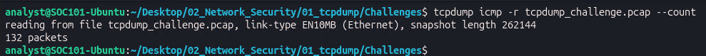
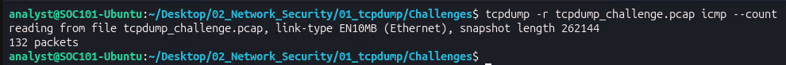
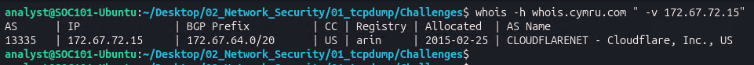
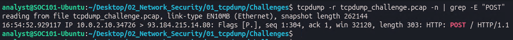
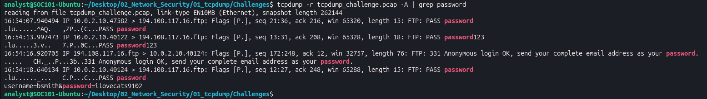
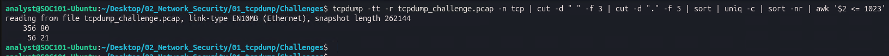
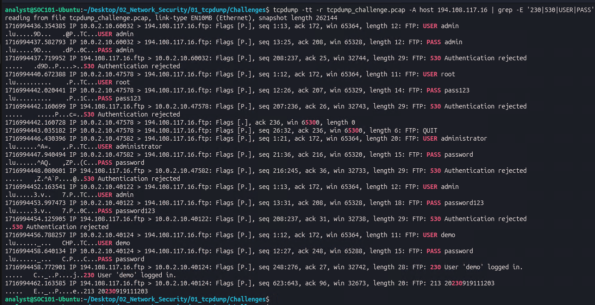
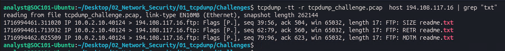
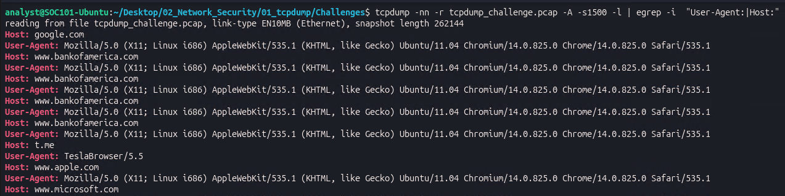
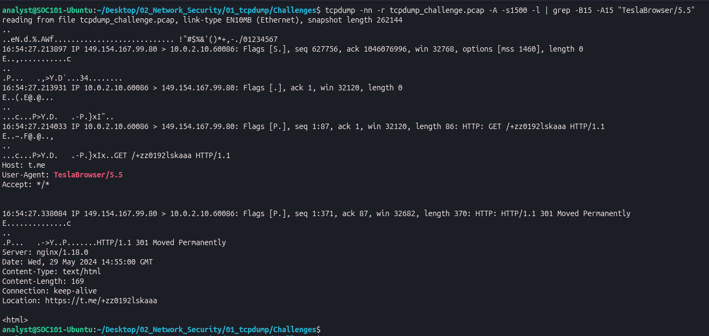

# SOC Investigation: Lumma Stealer Detection via Network Traffic Analysis

**Case ID:** SOC-2026-0529-001
**Analyst:** miro lerch
**Date:** 2026-05-29
**Classification:** TLP:WHITE
**Status:** Closed - Confirmed Malware Activity

---

## Executive Summary

On 2026-05-29 at approximately 14:53 UTC, endpoint `10.0.2.10` at Astley Financial triggered multiple SOC detections consistent with an active **Lumma Stealer (LummaC2)** infection. Analysis of `tcpdump_challenge.pcap` (1,344 packets) using exclusively Linux CLI tools confirmed four distinct threat activities:

- **Lumma Stealer C2 beacon** - hardcoded user agent `TeslaBrowser/5.5` communicating with Telegram dead-drop resolver `t.me/+zz0192lskaaa`
- **FTP credential brute-force** against `194.108.117.16:21` - 5 attempts across rotating source ports, 1 successful login (`demo:password`)
- **Credential exfiltration** via HTTP POST - employee credentials `bsmith:ilovecats9102` transmitted in cleartext to `93.184.215.14:80`
- **ICMP reconnaissance** - 132 packets observed including traffic to Cloudflare-fronted infrastructure (`172.67.72.15`, ASN 13335)

**Business Impact:** Active credential theft confirmed on a financial institution endpoint. One FTP session successfully authenticated. Employee credentials exfiltrated over unencrypted HTTP. Immediate containment required.

---

## Threat Scenario

> The SOC received an alert indicating abnormal behavior on endpoint `10.0.2.10`. Multiple detections fired simultaneously. As the on-call SOC Analyst at Astley Financial, you are handed a packet capture and tasked with determining what happened, how, and what to do next.

**Malware Family:** Lumma Stealer (LummaC2)
**Type:** Information Stealer / Malware-as-a-Service (MaaS)
**First Seen:** August 2022 on Russian-speaking cybercrime forums
**Threat Actor:** "Shamel" / alias "Lumma"
**Targets:** Cryptocurrency wallets, 2FA browser extensions, stored browser credentials
**Exfiltration Method:** HTTP POST with hardcoded user agent `TeslaBrowser/5.5`
**C2 Discovery:** Telegram dead-drop resolver
**Reference:** [Malpedia - win.lumma](https://malpedia.caad.fkie.fraunhofer.de/details/win.lumma)

---

## Investigation Walkthrough

### Question 1 - Total Packet Count

**Objective:** Establish the scope of the capture.

**Command:**

    tcpdump -r tcpdump_challenge.pcap --count

**Result:** 1344 packets

1,344 packets is a manageable capture for full manual CLI review.

---

### Question 2 - ICMP Packet Count

**Objective:** Identify reconnaissance or keep-alive activity via ICMP.

**Command:**

    tcpdump -r tcpdump_challenge.pcap icmp --count

**Result:** 132 ICMP packets

132 ICMP packets is anomalous for a standard endpoint. Consistent with host discovery sweeps or C2 keep-alive mechanisms.

---

### Question 3 - ASN of ICMP Destination

**Objective:** Identify who the endpoint was pinging.

**Command:**

    whois -h whois.cymru.com " -v 172.67.72.15"

**Result:** ASN 13335 - CLOUDFLARENET (Cloudflare, Inc.)

Cloudflare commonly fronts legitimate services but is also widely used to mask malicious C2 infrastructure. Flagged for further investigation.

---

### Question 4 - HTTP POST Requests

**Objective:** Detect outbound data exfiltration attempts.

**Command:**

    tcpdump -r tcpdump_challenge.pcap -n | grep -E "POST"

**Result:** 1 HTTP POST request - `10.0.2.10:34726 → 93.184.215.14:80`

A single POST to a bare `/` path is a common pattern for C2 data exfiltration.

---

### Question 5 - Credentials in HTTP Payload

**Objective:** Extract cleartext credentials from HTTP packet payloads.

**Command:**

    tcpdump -r tcpdump_challenge.pcap -A | grep password

**Result:** `username=bsmith&password=ilovecats9102`

**Finding:** Employee credentials for user `bsmith` transmitted in cleartext via HTTP POST. Active exfiltration confirmed.

---

### Question 6 - Well-Known TCP Ports

**Objective:** Identify all active services on the network.

**Command:**

    tcpdump -tt -r tcpdump_challenge.pcap -n tcp | cut -d " " -f 3 | cut -d "." -f 5 | sort | uniq -c | sort -nr | awk '$2 <= 1023'

**Result:** Port 80 (HTTP) and Port 21 (FTP)

FTP on port 21 is unencrypted and a common target for credential attacks.

---

### Question 7 - FTP Credential Brute-Force

**Objective:** Identify all FTP authentication attempts and determine valid credentials.

**Command:**

    tcpdump -tt -r tcpdump_challenge.pcap -A host 194.108.117.16 | grep -E '230|530|USER|PASS'

**FTP Response Codes:** 230 = Login successful / 530 = Authentication rejected

**All Attempts:**

| Timestamp | Source Port | Username | Password | Response |
|-----------|-------------|----------|----------|----------|
| 14:53:56 | 60032 | admin | admin | 530 Rejected |
| 14:54:00 | 47578 | root | pass123 | 530 Rejected |
| 14:54:06 | 47582 | administrator | password | 530 Rejected |
| 14:54:12 | 40122 | admin | password123 | 530 Rejected |
| 14:54:16 | **40124** | **demo** | **password** | **230 Logged in** |

**Finding:** Classic low-and-slow credential spray using rotating source ports per attempt to evade rate-limiting. Fifth attempt succeeded with default credentials `demo:password`.

---

### Question 8 - File Retrieved via FTP

**Objective:** Identify what data was accessed post-authentication.

**Command:**

    tcpdump -tt -r tcpdump_challenge.pcap host 194.108.117.16 | grep "txt"

**Result:** RETR readme.txt

Post-authentication file retrieval confirmed. File metadata also queried - last modified: 20230919111203.

---

### Question 9 - Malware Identification via User-Agent

**Objective:** Identify the malware family from HTTP traffic.

**Command:**

    tcpdump -nn -r tcpdump_challenge.pcap -A -s1500 -l | egrep -i "User-Agent:|Host:"

**Result:** User-Agent: TeslaBrowser/5.5

**Finding:** `TeslaBrowser/5.5` is the hardcoded user agent of Lumma Stealer. No legitimate browser uses this string. OSINT search on `TeslaBrowser/5.5 malware` immediately confirms the malware family.

**References:**
- [Malpedia - win.lumma](https://malpedia.caad.fkie.fraunhofer.de/details/win.lumma)
- [Darktrace - Rise of Lumma Info-Stealer](https://darktrace.com/blog/the-rise-of-the-lumma-info-stealer)

---

### Question 10 - C2 URL

**Objective:** Identify the full C2 communication URL.

**Command:**

    tcpdump -nn -r tcpdump_challenge.pcap -A -s1500 -l | grep -B15 -A15 "TeslaBrowser/5.5"

**Raw Request:** GET /+zz0192lskaaa HTTP/1.1 - Host: t.me - User-Agent: TeslaBrowser/5.5

**Server Response:** HTTP/1.1 301 Moved Permanently - Location: https://t.me/+zz0192lskaaa

**Defanged URL:** hxxps[://]t[.]me/+zz0192lskaaa

**Finding:** Lumma Stealer uses Telegram as a dead-drop resolver to retrieve the current C2 server address - allowing operators to rotate infrastructure without recompiling the binary.

**VirusTotal:** [URL Analysis](https://www.virustotal.com/gui/url/4a12f6edb36c6795c53a249fe015265a63b92f91ce3755245453c6f9e02e9e8f)

---

## Attack Chain

**Step 1 - Execution**
Lumma Stealer executes on endpoint 10.0.2.10.

**Step 2 - C2 Discovery (T1102.002)**
The malware sends GET /+zz0192lskaaa to t.me with User-Agent TeslaBrowser/5.5. The server returns a 301 redirect to https://t.me/+zz0192lskaaa. Telegram is used as a dead-drop resolver to retrieve the active C2 server address.

**Step 3 - Reconnaissance (T1046)**
132 ICMP packets sent to 172.67.72.15 (ASN 13335 — Cloudflare). 143 DNS queries sent to 8.8.8.8.

**Step 4 - Credential Access (T1110.003)**
FTP credential spray against 194.108.117.16 on port 21. Five attempts using rotating source ports. Four rejected with code 530. Fifth attempt with demo:password succeeds with code 230.

**Step 5 - Collection**
Authenticated FTP session used to retrieve readme.txt. File metadata queried — last modified 20230919111203.

**Step 6 - Exfiltration (T1048.003)**
HTTP POST to 93.184.215.14 on port 80. Body contains username=bsmith&password=ilovecats9102 in cleartext.

---

## IOC Table

| Type | Value | Context | Confidence |
|------|-------|---------|-----------|
| IP | 10.0.2.10 | Infected endpoint | High |
| IP | 149.154.167.99 | Lumma C2 discovery - Telegram infrastructure | High |
| IP | 194.108.117.16 | FTP brute-force target | High |
| IP | 93.184.215.14 | HTTP POST exfiltration destination | High |
| IP | 172.67.72.15 | Cloudflare ICMP peer — ASN 13335 | Medium |
| User-Agent | TeslaBrowser/5.5 | Lumma Stealer hardcoded user agent | High |
| URL | hxxps[://]t[.]me/+zz0192lskaaa | Telegram dead-drop C2 resolver | High |
| Credential | demo:password | Compromised FTP account | High |
| Credential | bsmith:ilovecats9102 | Exfiltrated employee credentials | High |
| File | readme.txt | Retrieved via FTP post-authentication | Medium |

---

## MITRE ATT&CK Mapping

| Tactic | ID | Technique | Evidence |
|--------|----|-----------|----------|
| Command & Control | T1102.002 | Web Service: Bidirectional Communication | TeslaBrowser/5.5 to Telegram dead-drop |
| Command & Control | T1071.001 | Application Layer Protocol: Web Protocols | C2 over HTTP port 80 |
| Credential Access | T1110.003 | Brute Force: Password Spraying | 5 FTP attempts with common credential pairs |
| Discovery | T1046 | Network Service Scanning | 132 ICMP packets and 143 DNS queries |
| Exfiltration | T1048.003 | Exfiltration Over Unencrypted Protocol | Credentials in cleartext HTTP POST body |
| Collection | T1005 | Data from Local System | Browser credentials harvested by Lumma |

---

## Incident Response Actions

**Immediate - P1 within 1 hour**
- Isolate 10.0.2.10 from the network
- Block 149.154.167.99, 93.184.215.14, 194.108.117.16 at perimeter firewall
- Block TeslaBrowser/5.5 at web proxy
- Revoke FTP account demo on 194.108.117.16
- Force password reset for user bsmith

**Short-Term - P2 within 24 hours**
- Preserve full disk image of 10.0.2.10 before remediation
- Hunt all proxy and firewall logs for historical TeslaBrowser/5.5 traffic
- Audit all accounts on 194.108.117.16 and remove all default credentials
- Review DNS logs from 10.0.2.10 for additional C2 domains

**Medium-Term - P3 within 1 week**
- Replace FTP with SFTP or disable entirely
- Deploy user agent blocklist at web proxy for known malware UAs
- Conduct organization-wide Lumma Stealer IOC hunt

---

## Skills Demonstrated

| Skill | Evidence |
|-------|---------|
| tcpdump packet analysis | All 11 findings derived from CLI - no GUI tools used |
| Protocol analysis FTP/HTTP/ICMP | FTP response codes, HTTP methods, ICMP patterns |
| Malware identification | Lumma Stealer identified via TeslaBrowser/5.5 OSINT |
| IOC extraction | IPs, URLs, credentials, filenames from raw pcap |
| MITRE ATT&CK mapping | 6 techniques across 5 tactics |
| Incident response | Prioritized IR actions with clear ownership |
| OSINT | Team Cymru whois for ASN lookup, VirusTotal URL analysis |

---

## Tools Used

| Tool | Purpose |
|------|---------|
| tcpdump | Primary packet capture analysis |
| grep / cut / sort / uniq / awk | Traffic aggregation and pattern matching |
| whois Team Cymru | IP geolocation and ASN lookup |
| Malpedia | Malware family identification |
| VirusTotal | URL reputation analysis |
| MITRE ATT&CK | Technique mapping |

---

*Investigation conducted in a controlled lab environment - TCM Security SOC101 Network Security Challenge. All findings based on provided packet capture data.*
