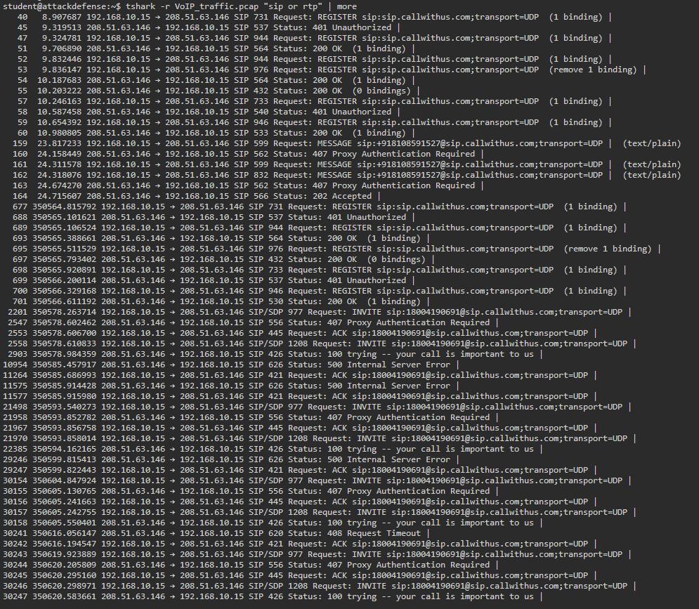
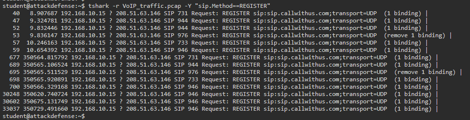
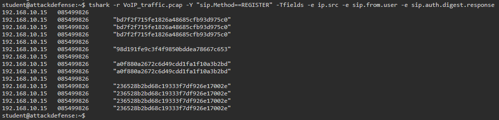
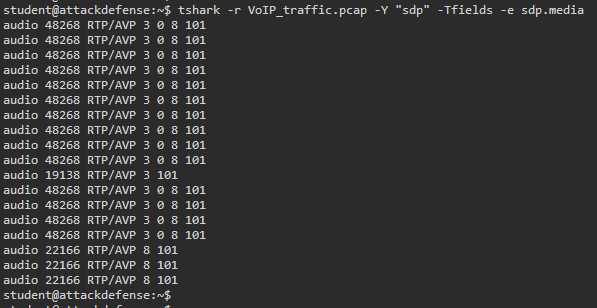
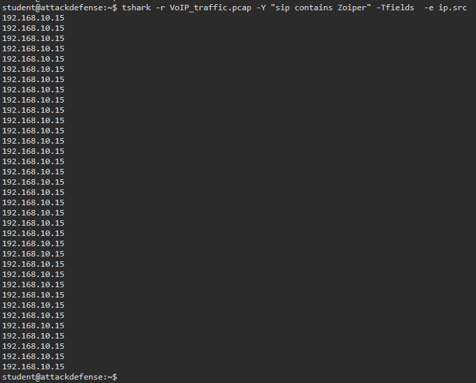
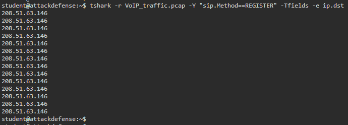
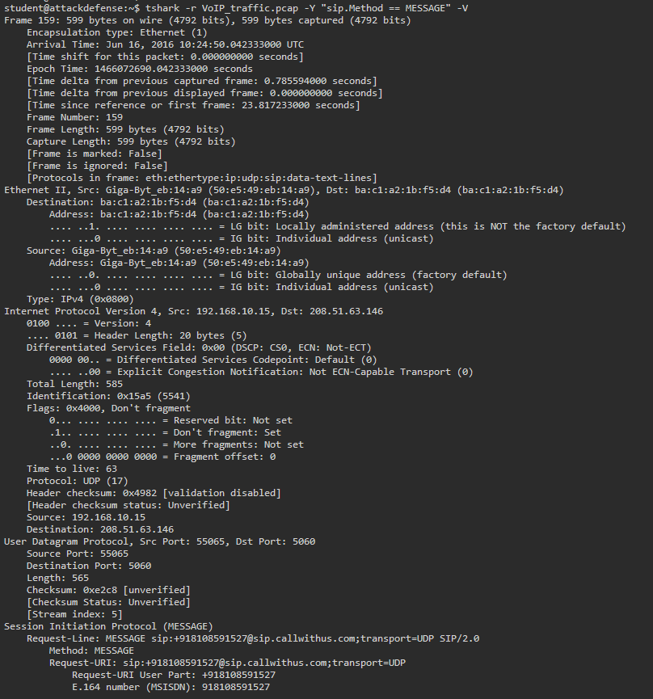
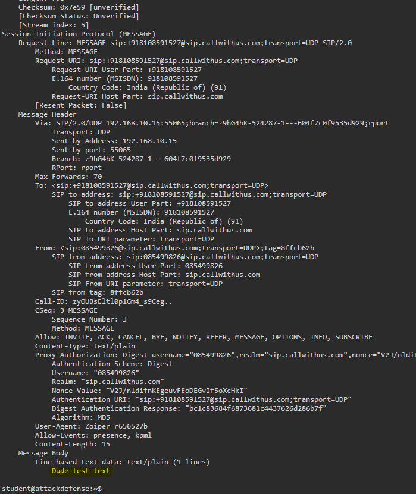
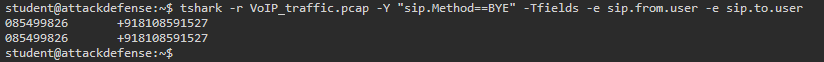

# Network Traffic Analysis Report

**Report Title:** VoIP Traffic Analysis  
**Analysis Type:** Network Traffic Analysis · Tshark · VoIP  
**Analyst:** Miro Lerch  
**Date:** 2026-06-25  
**Status:** Closed

---

## Overview

| Field | Value |
|-------|-------|
| **Capture file** | `VoIP_traffic.pcap` |
| **Protocols** | SIP / RTP |
| **Client IP (Zoiper)** | 192.168.10.15 |
| **SIP server IP** | 208.51.63.146 |
| **Sending extension** | 085499826 |
| **Called number** | +918108591527 |
| **Message content** | Dude test text |
| **Extensions (completed call)** | 085499826 → +918108591527 |

---

## Analysis

### Show VoIP Traffic

VoIP traffic consists of two protocols: SIP handles call signaling (registration, call setup), RTP carries the audio stream. Combining both filters displays all VoIP-relevant packets in the capture.

```bash
tshark -r VoIP_traffic.pcap -Y "sip or rtp"
```



---

### Print All REGISTER Packets

REGISTER is the SIP method a client uses to register its current location with the SIP server. Filtering for this method shows all registration attempts in the capture.

```bash
tshark -r VoIP_traffic.pcap -Y "sip.Method==REGISTER"
```



---

### Source IP, Sender Extension & Auth Digest Response

`-Tfields -e` extracts specific fields as columns - no grep needed. The digest response is the MD5 hash sent by the client to authenticate against the SIP server.

```bash
tshark -r VoIP_traffic.pcap -Y "sip.Method==REGISTER" -Tfields -e ip.src -e sip.from.user -e sip.auth.digest.response
```

**Result:**

| Source IP | Extension | Digest Response |
|-----------|-----------|-----------------|
| 192.168.10.15 | 085499826 | bd7f2f715fe1826a48685cfb93d975c0 |
| 192.168.10.15 | 085499826 | 98d191fe9c3f4f9850bddea78667c653 |
| 192.168.10.15 | 085499826 | a0f880a2672c6d49cdd1fa1f10a3b2bd |
| 192.168.10.15 | 085499826 | 236528b2bd68c19333f7df926e17002e |



---

### Codecs Used by RTP Protocol

SDP (Session Description Protocol) is embedded in SIP packets and negotiates the audio codecs and ports for the RTP stream. The `sdp` filter with the `sdp.media` field shows all offered codecs.

```bash
tshark -r VoIP_traffic.pcap -Y "sdp" -Tfields -e sdp.media
```

**Result:**

| SDP Media Line |
|----------------|
| audio 48268 RTP/AVP 3 0 8 101 |
| audio 19138 RTP/AVP 3 101 |
| audio 22166 RTP/AVP 8 101 |



---

### IP Address of Zoiper VoIP Client

`sip contains` performs a substring match against the entire SIP payload. The User-Agent field in SIP headers identifies the client software - here Zoiper.

```bash
tshark -r VoIP_traffic.pcap -Y "sip contains Zoiper" -Tfields -e ip.src
```

**Result:** `192.168.10.15`



---

### IP Address of SIP Server

REGISTER packets are always sent from the client to the SIP server. Extracting the destination IP of REGISTER packets identifies the server.

```bash
tshark -r VoIP_traffic.pcap -Y "sip.Method==REGISTER" -Tfields -e ip.dst
```

**Result:** `208.51.63.146`



---

### Content of Text Message Sent to +918108591527

The SIP MESSAGE method carries instant messages over SIP. `-V` prints the full decoded packet including the message body in plaintext.

```bash
tshark -r VoIP_traffic.pcap -Y "sip.Method == MESSAGE" -V
```

**Result:** `Dude test text`





---

### Extensions That Completed a Call Successfully

A BYE packet is only sent when a call was successfully established and then terminated. Filtering for BYE and extracting the from/to fields shows which extensions completed a full call.

```bash
tshark -r VoIP_traffic.pcap -Y "sip.Method==BYE" -Tfields -e sip.from.user -e sip.to.user
```

**Result:**

| From | To |
|------|----|
| 085499826 | +918108591527 |



---

## Summary

The capture file `VoIP_traffic.pcap` contained VoIP traffic between internal host `192.168.10.15` (Zoiper client) and external SIP server `208.51.63.146`. Extension `085499826` registered multiple times against the server and sent a plaintext SIP MESSAGE (`Dude test text`) to `+918108591527`. A successful voice call between `085499826` and `+918108591527` was confirmed via BYE packet. Audio codecs negotiated via SDP included PCMU, PCMA, GSM and DTMF (payload types 0, 3, 8, 101).

---

## Tools Used

| Tool | Purpose |
|------|---------|
| Tshark | CLI packet analysis and field extraction |

---

*References: [Tshark](https://www.wireshark.org/docs/man-pages/tshark.html) · [Wireshark](https://www.wireshark.org/)*
